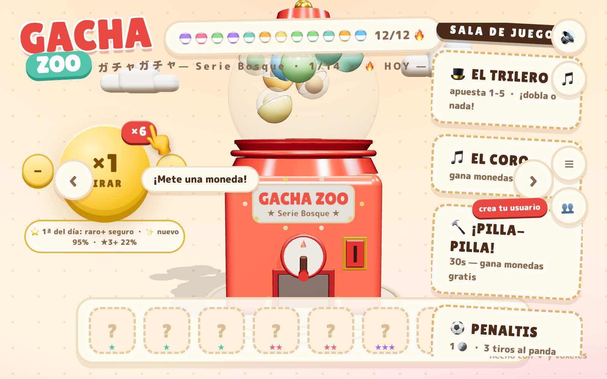
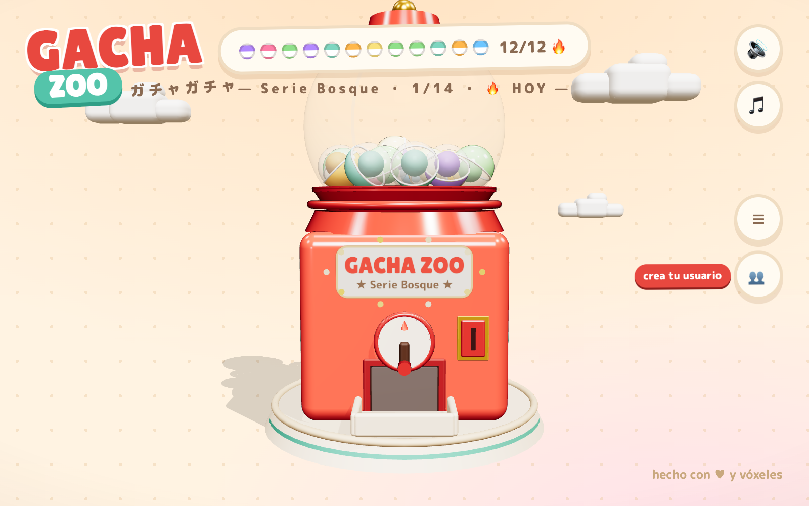

<p align="center">
  
</p>

<h1 align="center">🐾 Gacha Zoo</h1>

<p align="center"><em>Una máquina gachapon 3D voxel llena de animalitos coleccionables. ¡Tira de la palanca y a ver qué cae! 🎰</em></p>

<p align="center">
  <a href="https://gavilanbe.github.io/gacha-zoo/"></a>
  
  
  
  
</p>

---

## Qué es esto

**Gacha Zoo** es un juego web de "gacha" hecho en **un único `index.html`** con **Three.js**: tiras cápsulas de una máquina gachapon 3D, coleccionas criaturas voxel repartidas en 14 series, las cuidas en tu Jardín y compites en varios minijuegos. Incluye un modo JRPG (el Dojo, con cinturones y duelos), una hucha clicker y banda sonora propia por serie. Todas las criaturas están modeladas por código, voxel a voxel.

## 📖 La historia

Detrás de cada cápsula hay un bichito esperando. Empiezas en la **Serie Bosque** con una máquina, una moneda y mucha ilusión: metes la moneda, tiras de la palanca y ves caer tu primera criatura. Poco a poco completas series, desbloqueas las raras y las épicas (¡ojo a las *lego*!), montas tu Jardín, entrenas en el Dojo y picoteas en los minijuegos —El Trilero, El Coro, Pilla-Pilla, Penaltis— para ganar monedas y seguir tirando. Una colección que crece sola, un poquito cada día.

## 🎮 Cómo se juega

| Acción | Cómo |
|---|---|
| 🪙 Meter moneda | Toca la ranura de la máquina para cargar una tirada |
| 🎰 Tirar | Tira de la palanca y abre la cápsula que cae |
| 🧊 Coleccionar | Cada criatura nueva ocupa su hueco en la serie (comunes, raras, épicas, *lego*) |
| 🕹️ Minijuegos | El Trilero, El Coro, Pilla-Pilla y Penaltis dan monedas para seguir tirando |
| 🥋 Dojo | Modo JRPG: sube de cinturón y gana duelos |
| 🌱 Jardín | Cuida y exhibe tu colección + hucha clicker |

Pensado para jugar **en el móvil en vertical**: todo se maneja con ratón o toque.

### 🔧 Parámetros de depuración (querystring)

| Parámetro | Efecto |
|---|---|
| `?demo=1` | Desbloquea la colección de la serie actual |
| `?s=N` | Fuerza una serie concreta (0-indexada) |
| `?garden=1` | Entra directamente al Jardín |
| `?dojo=1` | Abre el panel del Dojo |

## 📸 Capturas

<p align="center">
  
  &nbsp;
  
</p>

## ▶️ Jugar

- 🌐 **Online:** [gavilanbe.github.io/gacha-zoo](https://gavilanbe.github.io/gacha-zoo/)
- 💻 **En local** (es un juego web estático, basta servir la carpeta):

```bash
python3 -m http.server 8431
# luego abre http://127.0.0.1:8431/index.html
```

Atajos útiles vía el `Makefile`: `make serve`, `make check`, `make help`.

## ⚠️ Estado

El despliegue público en **GitHub Pages** es **100 % cliente** (Three.js por CDN + guardado en `localStorage`): la máquina, las criaturas, el Jardín, el Dojo y los minijuegos funcionan al completo sin servidor.

Las **funciones de familia** (cuentas con PIN, *cloud save*, intercambios y rankings entre miembros) dependen de un **backend de Cloudflare Workers + base de datos D1** (`worker-src.js` → `_worker.js`, `schema.sql`) que **no corre en GitHub Pages**. En este despliegue esas llamadas degradan con elegancia ("sin conexión con la familia") y el juego sigue siendo totalmente jugable en modo individual. Para la experiencia familiar completa hay que desplegar sobre **Cloudflare Pages** con el Worker y la D1 enlazados.

## 🛠️ Bajo el capó

- 🧊 **Three.js r160** (vía importmap + CDN jsdelivr) para el 3D voxel modelado por código.
- 📄 HTML + CSS + un `<script type="module">` — **todo el juego vive en `index.html`**.
- ☁️ **Cloudflare Workers + D1** (opcional) para cuentas, *cloud save* y multijugador familiar.
- 🎵 Música compuesta en Python (MIDI maestro en `src-music/`) y renderizada con fluidsynth + SoundFont a `.m4a`, una banda sonora por serie.
- 📱 **PWA** instalable: `manifest.json` + `sw.js`.
- 🚀 Build estático reproducible (`build.sh`) y despliegue a GitHub Pages vía GitHub Actions.

> Nota: varias series son fan-art de IP ajena hecho para uso personal/familiar. El despliegue lleva `noindex` y no hay monetización.

## 📦 Créditos

Hecho con 💛 y vóxeles por [@gavilanbe](https://github.com/gavilanbe). Proyecto personal y familiar hecho por diversión. ¡Feliz colección! 🐣

## 📄 Licencia

[MIT](LICENSE)
